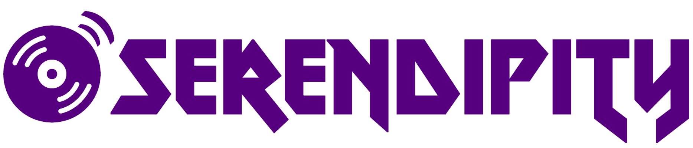

<!-- PROJECT LOGO -->
 

    
  </a>

  <h3 align="center">Servicio web para la recomendación de playlists a partir de otra playlist</h3>

  

    Trabajo de Fin de <a href="https://www.uclm.es/estudios/masteres/master-ingenieria-informatica-albacete">Máster para el Máster Universitario en Ingeniería Informática</a> de la <a href="https://www.uclm.es">Universidad de Castilla-La Mancha</a>
     
     
    <a href="docs/MEMORIA_TFM_SERENDIPITY.pdf">Memoria del proyecto</a>
    ·
    <a href="https://www.youtube.com/watch?v=1213YzkQIqU">Demo WebApp</a>
    <!-- .
    <a href="https://github.com/othneildrew/Best-README-Template/issues">Request Feature</a> -->
  

<!-- ABOUT THE PROJECT -->
## Acerca del proyecto

 

### Resumen

En la actualidad, compartir y descubrir nueva música resulta muy sencillo dada la cantidad de servicios de música en streaming (_Spotify_, _YouTube Music_, _Apple Music_…) o redes sociales musicales (_Last.fm_).

Antes del auge de Internet y la aparición de los servicios musicales, las formas más comunes de descubrir música se limitaban a la radio y al intercambio de medios (como casetes o CDs). Centrándonos en ésta última forma, era muy común intercambiar recopilaciones entre amigos con gustos similares para descubrir nuevas canciones. Estas grabaciones, en
algunos casos, podían ser recopilaciones especiales para reproducir mientras se realizaban actividades como pueden ser hacer deporte, estudiar, viajar, etc. Actualmente este tipo de recopilaciones han sido sustituidas por playlists musicales, donde cada usuario añade las canciones que le gustan bajo un título que las identifique.

La gran mayoría de los servicios musicales hacen muy sencillo buscar una canción similar a la que se está reproduciendo, y también ofrecen recomendaciones de emisoras (bloques de canciones, que pueden ser aleatorias, relacionadas con el género de la canción o con artistas relacionados). Sin embargo, es muy poco frecuente ofrecer playlists de otros usuarios
como recomendación a otra playlist que estamos escuchando.

El objetivo de este proyecto es proporcionar un sistema que, dada una playlist, mediante su título, canciones que la conforman y otras características dadas, encuentre otras playlists similares entre los distintos usuarios de _Spotify_ para ofrecer al usuario.

### Autoría
<u>Alumno</u>:
* Miguel Ángel Cantero Víllora

<u>Tutores</u>:
* José Antonio Gámez Martín
* Juan Ángel Aledo Sánchez

(<a href="#top">volver al inicio</a>)

## Tecnologías empleadas

 

### Lenguajes
* __Python__: Ciencia de datos y servicio web
* __HTML__ y __C#__: Aplicación web 

### Herramientas de desarrollo 
* __Jupyter Notebook__: Entorno de programación interactivo, mediante el cual podemos introducir texto en formato _markdown_ junto a código _Python_ haciendo uso de los _notebooks_ o libretas.
* __Visual Studio Code__: Conocido editor de código de _Microsoft_, el cual ha sido empleado a la hora de visualizar los archivos creados para almacenar los datos, tanto en formato _CSV_ como _JSON_, para el desarrollo de scripts empleados para ejecutar los procesos relacionados con la recopilación de datos y el entrenamiento del modelo, y para desarrollar la aplicación web y la _API REST_.

### Bibliotecas
* __Spotipy__: Biblioteca de Python para usar la WebAPI de Spotify.
* __Numpy__: Ofrece mayor soporte a vectores y matrices, constituyendo una biblioteca de funciones matemáticas de alto nivel para operar con estos elementos.
* __Pandas__: Es una biblioteca de código abierto para Python que proporciona estructuras de datos y herramientas de análisis de alto rendimiento y fáciles de emplear.
* __NLTK__: Este toolkit es una de las bibliotecas más potentes para procesamiento del lenguaje natural.
* __SciPy__: Biblioteca de código abierto basada en Python, que se utiliza en matemáticas,
ciencia e ingeniería.
* __Scikit-Learn__: Biblioteca empleada para problemas de aprendizaje automático o machine learning.
* __LightFM__: Es una biblioteca que contiene numerosos algoritmos utilizados en los sistemas de recomendación.
* __Azure SDK__: Conjunto de herramientas para emplear los servicios creados en _Microsoft Azure_.
* __.NET 5__: Framework multiplataforma gratuito y open source que nos permite el desarrollo de aplicaciónes. En particular utilizaremos Blazor, que viene integrado en el
framework ,y es un completo marco de trabajo para compilar aplicaciones web.

### Servicios en la nube
Para desplegar la infraestructura, se ha utilizado _Microsoft Azure_ como proveedor de servicios en la nube. Los servicios empleados son los siguientes:
* __Azure Machine Learning Studio__: Área de trabajo que incorpora todos los elementos necesarios para realizar proyectos de _machine learning_, como por ejemplo: libretas _Jupyter_ (incorporando un entorno propio para ejecutarlas), colecciones de modelos,experimentos, instancias de cómputo, etc.
* __Virtual Machines__: Uso de máquinas virtuales en la nube.
* __Azure Cosmos DB__: Base de datos _NoSQL_, de acceso rápido y con alta disponibilidad, respaldadas por un Acuerdo de Nivel de Servicio, escalabilidad automática e instantánea.
* __Azure Functions__: Servicio que proporciona toda la infraestructura y los recursos, que se actualizan continuamente, necesarios para ejecutar aplicaciones.
* __API Managment__: Espacio de trabajo donde podemos configurar distintas _APIs_ (propias o de terceros) añadiendo una capa de abstracción que unifica el acceso de desarrolladores a ellas.
* __Azure Blob Storage__: Solución de almacenamiento de objetos en la nube.
* __Azure DevOps__: Servicio que proporciona control de versiones, informes, gestión de
requisitos, gestión de proyectos, compilaciones automatizadas, pruebas y capacidades de gestión de versiones.

(<a href="#top">volver al inicio</a>)
